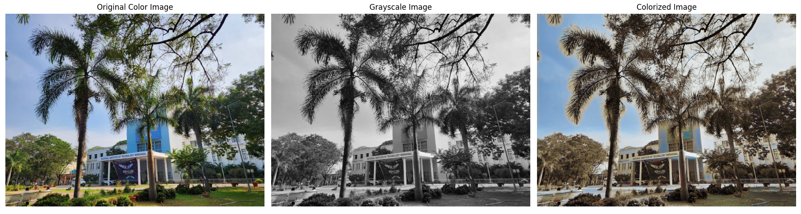

# Image Colorizer

A deep learning project that colorizes grayscale images using a trained neural network model.

## Project Overview

This project uses a deep convolutional neural network (CNN) to colorize grayscale images. The model takes a grayscale image as input and outputs a colorized version of the image. This project utilizes PyTorch for building and training the model, and it is designed to be a simple tool for image colorization tasks.

## Features

- **Grayscale Image Colorization**: Converts grayscale images to colorized images using deep learning.
- **File Selection**: Allows the user to select an image file via a file dialog to perform colorization.
- **Image Display**: Displays the original, grayscale, and colorized images side by side.
- **Save Output**: Saves the colorized image as a new file.

## Usage

1. Run the script to colorize an image:
    ```bash
    python predict.py
    ```
2. A file dialog will appear. Select the image you want to colorize.
3. The colorized image will be displayed alongside the original grayscale image.
4. The colorized image will be saved as `prediction_output.png`.

## Requirements

- Python 3.x
- PyTorch
- PIL (Python Imaging Library)
- Tkinter (for file dialog)

### Example Output

Here's an example of the output image after colorization:


